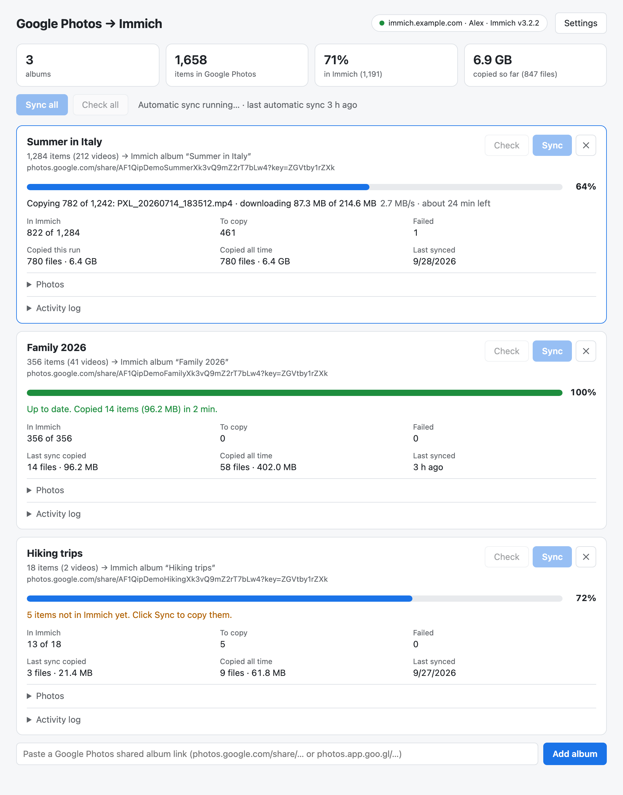
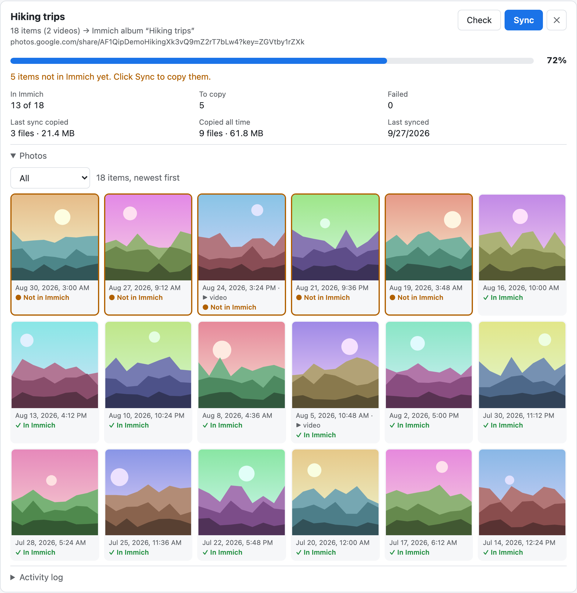
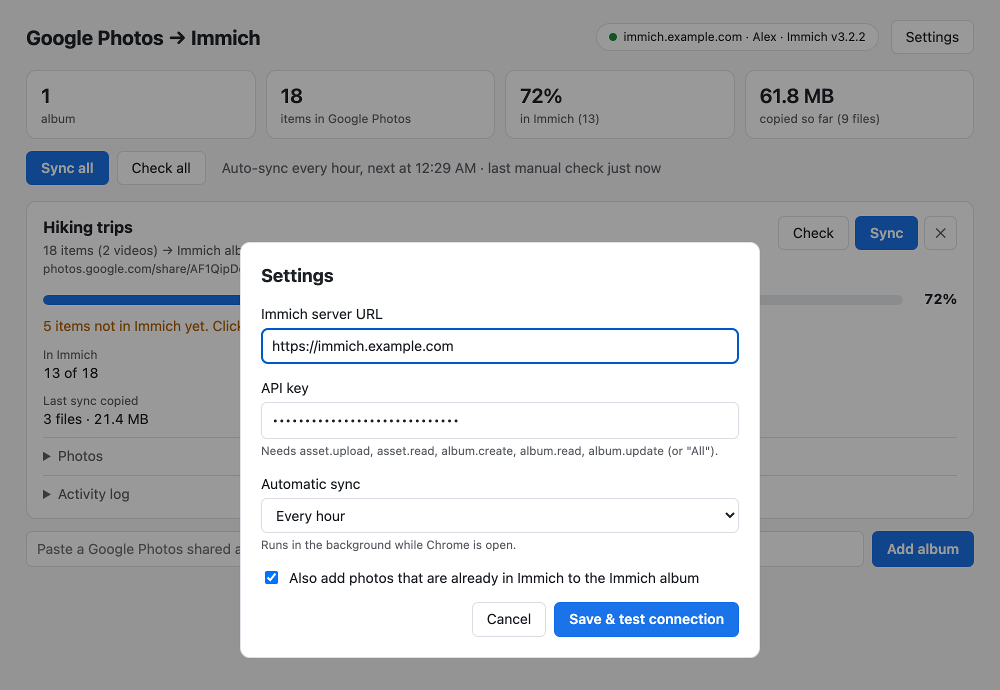

# Google Photos → Immich sync

A Chrome extension that keeps selected **Google Photos shared albums** in sync with
[Immich](https://immich.app), periodically and in the background, using the Google account
you are already signed in to in the browser.

Only the albums you list are synced, not your whole library. Photos Immich already has are
detected by checksum and never imported twice. This works with libraries you seeded from a
Google Takeout export using [immich-go](https://github.com/simulot/immich-go): the extension
recognises those existing photos correctly and only uploads what's new (tested). Photos and
videos are both supported.



## Why an extension?

- **No server, no backend.** Nothing to host, deploy, secure or keep running. The extension
  talks directly from your browser to Google Photos and to your Immich server, and nowhere else.
- **Your signed-in session just works.** Google has no API for albums shared with an account
  (the Photos Library API doesn't expose them), and scraping from a server means handling
  logins, 2FA, cookies and bot checks. In the browser you are already logged in, so none of
  that exists.
- **Less overhead.** No OAuth app, no Google Cloud project, no cookie export, no container,
  no cron. Load it, paste two things, done.
- **Runs where you already are.** Sync happens in the background while Chrome is open, via
  `chrome.alarms`.

## Features

- Sync only the albums you choose (paste their Google Photos URLs).
- Deduplication by SHA-1 against your **entire** Immich library, before anything is downloaded.
- Works alongside an [immich-go](https://github.com/simulot/immich-go) Google Takeout import:
  use Takeout for the bulk history, the extension for everything added afterwards.
- Uploads missing items **oldest first**, so an interrupted run never leaves gaps.
- Mirrors each Google album into an Immich album with the same name (created if missing).
- Photos and videos; originals are downloaded, not thumbnails.
- Per-album progress: percentage in Immich, the file being copied, download progress,
  speed and time left. It works for background syncs too, and the toolbar icon shows the percentage.
- Stats: items in Immich, still to copy, failed, and files and bytes copied per sync and in total.
- **Check** compares an album with Immich without copying anything.
- Periodic background sync with a configurable interval. Manual and background runs never overlap.

## Screenshots

**Photos in an album**, each marked with whether it is already in Immich:



**Settings**, where you connect Immich and choose how often to sync:



The screenshots show made-up albums and generated placeholder images. `npm run screenshots`
recreates them from the real extension page.

## Install

1. Clone or download this repository.
2. Open `chrome://extensions`, enable **Developer mode**, click **Load unpacked** and select
   the repository folder.
3. Make sure Chrome is signed in to the Google account that can see the albums.

## Use

1. Click the extension's toolbar icon to open its page. **Settings** opens on first use.
2. Enter your **Immich server URL** and an **API key**, and choose how often to sync
   automatically. Chrome asks for permission to reach your Immich server when you save,
   and the connection is tested straight away.
3. Paste a Google Photos shared album link and click **Add album**. Both
   `https://photos.google.com/share/...` and `https://photos.app.goo.gl/...` links work. The
   album is checked right away, so you see how much of it is already in Immich.
4. Click **Sync** on an album, or **Sync all**. After that the background sync takes over.

Each album card shows its percentage in Immich, what is happening now, and its stats.
**Photos** shows the album with each item marked *In Immich*, *Not in Immich*, *Copied* or
*Failed*. **Activity log** keeps the last 200 events. If a sync is interrupted (Chrome
closed, tab closed), the card says so, and the next run continues where it stopped.

**API key permissions:** `asset.upload`, `asset.read`, `album.create`, `album.read`,
`album.update` (or "All").

By default photos already in Immich are also added to the matching Immich album. Untick
*Also add photos already in Immich to the album* if you'd rather it never touches albums
for existing photos.

## How it works

1. **List.** The album page is fetched with your browser's cookies and the photo list is read
   from the data embedded in it; further pages come from Google's internal `batchexecute`
   endpoint (rpc `snAcKc`).
2. **Deduplicate.** For each photo Google supplies a `dedupKey`, which is the URL-safe base64
   SHA-1 of the original file. That is exactly what Immich stores as its asset `checksum`, so
   the keys are sent to `POST /assets/bulk-upload-check` and Immich says which it already has.
3. **Upload.** Only the missing originals are downloaded (`=d` for photos, `=dv` for videos),
   re-hashed, and uploaded with an `x-immich-checksum` header so Immich itself also refuses
   duplicates.
4. **Mirror.** Uploaded (and optionally existing) assets are added to an Immich album named
   after the Google album.

A small local ledger (`mediaKey → Immich asset id`) stops anything from being re-uploaded if
a checksum ever differs.

## Privacy and permissions

- The extension contacts only `photos.google.com` / Google's image hosts and the Immich
  server you configure. There is no analytics and no third-party server.
- Your Immich URL and API key are stored in `chrome.storage.local` on your machine. It is
  not encrypted, so use a dedicated API key with only the permissions above.
- Host access to your Immich server is requested at runtime (optional permission), not
  granted broadly at install.

## Limitations

- **Unofficial.** Google Photos has no public API for this, so the extension reads the same
  undocumented data the web app uses. Google can change it at any time and break the extension.
- **Chrome must be running** and signed in to Google for background syncs to happen. Sync
  runs at most every 5 minutes.
- **Matching is by SHA-1.** Photos Google has re-encoded (not "original quality") won't match
  an Immich copy of the original byte for byte.
- One-way only: Google Photos → Immich. Nothing is ever changed or deleted in Google Photos,
  and nothing is deleted from Immich.

## Development

```sh
npm install
npm test                # unit tests (mocked fetch, fixtures modelled on real responses)
```

To drive the extension from scripts, launch a dedicated Chromium with the extension loaded and
the DevTools protocol on `:9222` (Chrome ≥ 137 ignores `--load-extension`, so this uses
Playwright's Chromium). Sign in to Google and save the Immich settings once in that window;
the profile is kept in `.debug-profile/`. The launcher loads a copy of the extension from
`.debug-ext/`, so restart it after changing the code. Restarting stops any sync running in it.

```sh
IMMICH_ORIGIN=https://immich.example.com npm run debug-browser
node scripts/probe.mjs <albumUrl> <view|check|sync> [screenshot.png]
```

Layout: `gphotos.js` (read albums, download originals), `immich.js` (Immich API client),
`sync.js` (orchestration), `state.js` (per-album progress/stats and the sync lock, shared through
`chrome.storage`), `background.js` (alarm-driven sync), `app.*` (the extension page).

## Disclaimer

Not affiliated with Google or Immich. Use at your own risk, and keep backups.
